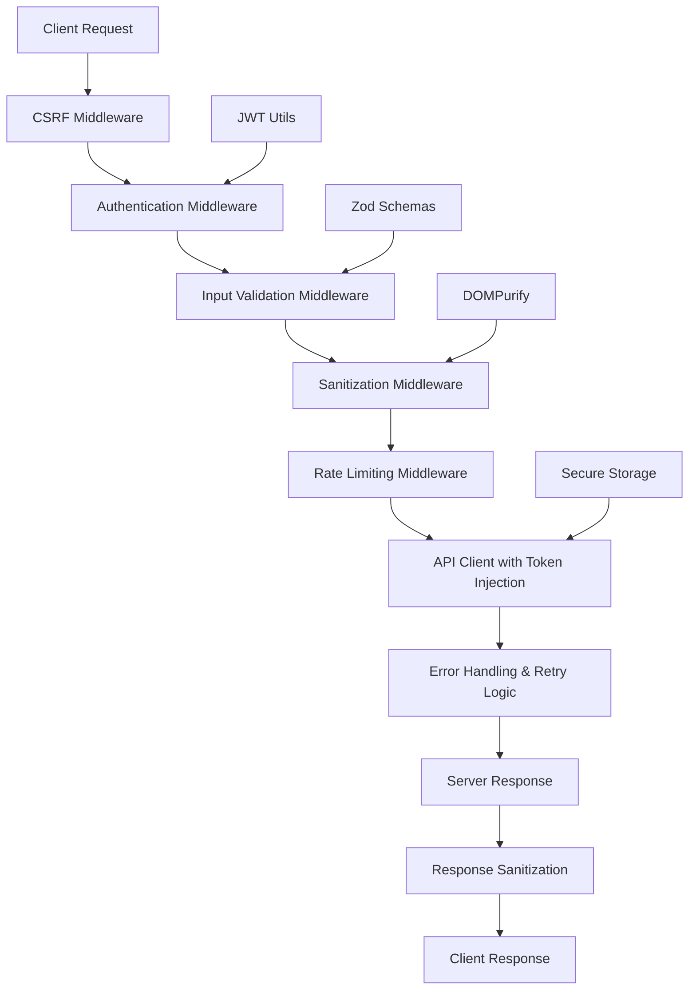

# API Security Implementation Plan for Pureza-Naturalis-V3

## Overview

This plan outlines the comprehensive API security middleware implementation for Pureza-Naturalis-V3, including authentication, CSRF protection, input validation, request sanitization, and a secure API client with automatic token injection, error handling, and retry logic.

## Current Security Analysis

Based on existing codebase analysis:

### Existing Components

- **api.ts**: Axios client with basic token injection and refresh logic
- **sanitizationMiddleware.ts**: Request/response sanitization using DOMPurify
- **validationSchemas.ts**: Zod schemas for form validation
- **authService.ts**: JWT-based authentication service
- **secureStorage.ts**: Encrypted localStorage utilities
- **sanitizer.ts**: HTML/text sanitization utilities

### Security Gaps Identified

- No CSRF protection
- No comprehensive input validation middleware
- Limited route-based authentication
- No unified security middleware layer
- Basic error handling without retry logic
- No request rate limiting per route

## Implementation Architecture



## Detailed Implementation Steps

### 1. Authentication Middleware (`middleware/authMiddleware.ts`)

**Purpose**: Validate JWT tokens and protect routes based on authentication requirements

**Features**:

- Token validation from Authorization header or cookies
- Route-based protection (public, authenticated, admin)
- Automatic token refresh on expiration
- User context injection into request

**Implementation**:

```typescript
interface AuthMiddlewareOptions {
  requireAuth?: boolean;
  requireAdmin?: boolean;
  allowPublic?: boolean;
}

export const authMiddleware = (options: AuthMiddlewareOptions) => {
  return async (config: AxiosRequestConfig) => {
    // Token validation logic
    // Route protection logic
    // User context injection
  };
};
```

### 2. CSRF Protection Middleware (`middleware/csrfMiddleware.ts`)

**Purpose**: Prevent Cross-Site Request Forgery attacks

**Features**:

- CSRF token generation and validation
- Double-submit cookie pattern
- SameSite cookie attributes
- Token rotation on authentication

**Implementation**:

```typescript
export const csrfMiddleware = {
  generateToken: () => string,
  validateToken: (token: string) => boolean,
  getTokenFromRequest: (config: AxiosRequestConfig) => string,
  middleware: (config: AxiosRequestConfig) => AxiosRequestConfig,
};
```

### 3. Input Validation Middleware (`middleware/validationMiddleware.ts`)

**Purpose**: Validate and sanitize all incoming request data using Zod schemas

**Features**:

- Schema-based validation for different endpoints
- Automatic error response generation
- Type-safe request data
- Custom validation rules

**Implementation**:

```typescript
interface ValidationRule {
  schema: z.ZodSchema;
  path: string;
  method: 'GET' | 'POST' | 'PUT' | 'DELETE';
}

export const validationMiddleware = (rules: ValidationRule[]) => {
  return (config: AxiosRequestConfig) => {
    // Schema validation logic
    // Error handling
  };
};
```

### 4. Enhanced Sanitization Middleware (`middleware/enhancedSanitizationMiddleware.ts`)

**Purpose**: Comprehensive request and response sanitization

**Features**:

- SQL injection prevention
- XSS protection
- Command injection protection
- File upload validation
- Content-Type validation

### 5. Secure API Client (`utils/secureApiClient.ts`)

**Purpose**: Enhanced API client with security features

**Features**:

- Automatic token injection
- Request/response encryption
- Comprehensive error handling
- Exponential backoff retry logic
- Request deduplication
- Circuit breaker pattern

**Implementation**:

```typescript
class SecureApiClient {
  private circuitBreaker: CircuitBreaker;
  private retryLogic: RetryLogic;

  async request<T>(config: SecureRequestConfig): Promise<T> {
    // Security-enhanced request logic
  }
}
```

### 6. Unified Security Layer (`middleware/securityLayer.ts`)

**Purpose**: Orchestrate all security middleware in correct order

**Features**:

- Middleware pipeline configuration
- Conditional middleware application
- Security audit logging
- Performance monitoring

### 7. Configuration and Setup (`config/securityConfig.ts`)

**Purpose**: Centralized security configuration

**Features**:

- Environment-based settings
- Route-specific security rules
- Rate limiting configuration
- CSRF settings

## Security Features Matrix

| Feature                   | Authentication | CSRF Protection | Input Validation | Sanitization | API Client |
| ------------------------- | -------------- | --------------- | ---------------- | ------------ | ---------- |
| JWT Token Validation      | ✅             |                 |                  |              | ✅         |
| Route Protection          | ✅             |                 |                  |              |            |
| CSRF Token Generation     |                | ✅              |                  |              |            |
| CSRF Token Validation     |                | ✅              |                  |              |            |
| Schema Validation         |                |                 | ✅               |              |            |
| XSS Prevention            |                |                 |                  | ✅           |            |
| SQL Injection Prevention  |                |                 |                  | ✅           |            |
| Automatic Token Injection |                |                 |                  |              | ✅         |
| Error Handling            |                |                 |                  |              | ✅         |
| Retry Logic               |                |                 |                  |              | ✅         |
| Rate Limiting             |                |                 |                  |              | ✅         |

## Integration Points

### Existing Code Integration

- Extend current `api.ts` with security middleware
- Enhance `sanitizationMiddleware.ts` with additional checks
- Utilize existing Zod schemas in `validationSchemas.ts`
- Integrate with `authService.ts` for token management
- Use `secureStorage.ts` for sensitive data storage

### Route Protection Examples

```typescript
// Public routes
GET /api/products - No auth required
GET /api/blog - No auth required

// Authenticated routes
POST /api/cart - Auth required
GET /api/profile - Auth required

// Admin routes
POST /api/products - Admin required
DELETE /api/users - Admin required
```

## Testing Strategy

### Unit Tests

- Individual middleware components
- Token validation logic
- CSRF token generation/validation
- Schema validation
- Sanitization functions

### Integration Tests

- Full middleware pipeline
- API client with security features
- Error handling scenarios
- Rate limiting behavior

### Security Tests

- Penetration testing
- XSS vulnerability checks
- CSRF attack simulations
- SQL injection attempts

## Performance Considerations

### Optimizations

- Middleware caching for repeated requests
- Lazy loading of validation schemas
- Efficient token validation
- Minimal overhead for public routes

### Monitoring

- Security event logging
- Performance metrics
- Error rate monitoring
- Rate limiting analytics

## Deployment Checklist

- [ ] Security middleware implemented
- [ ] CSRF protection configured
- [ ] Input validation schemas created
- [ ] API client enhanced with security features
- [ ] Authentication middleware deployed
- [ ] Rate limiting configured
- [ ] Security tests passing
- [ ] Performance benchmarks met
- [ ] Documentation updated
- [ ] Security audit completed

## Risk Mitigation

### Potential Issues

1. **Token Expiry Race Conditions**: Handled by refresh token logic
2. **CSRF Token Storage**: Secure HTTP-only cookies
3. **Rate Limiting Bypass**: IP-based and user-based limiting
4. **Memory Leaks**: Proper cleanup in middleware
5. **Performance Impact**: Optimized middleware pipeline

### Fallback Mechanisms

- Graceful degradation on security failures
- Fallback to basic auth for critical operations
- Error boundaries for security middleware failures

This implementation provides comprehensive API security while maintaining performance and usability. The modular design allows for easy maintenance and future enhancements.
