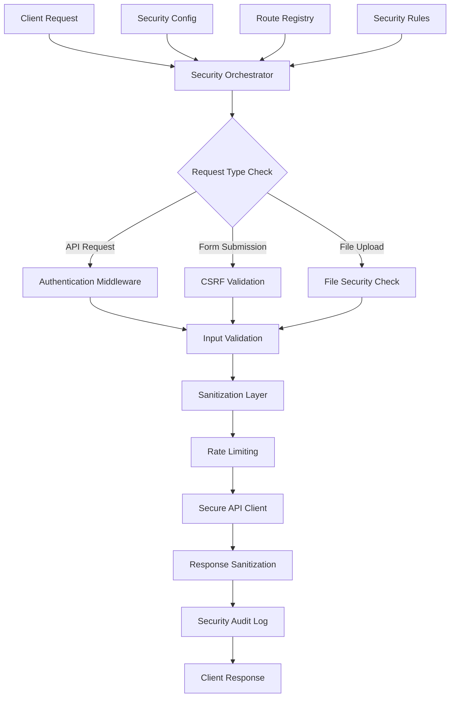

# Unified Security Layer Implementation for Pureza-Naturalis-V3

## Overview

This document details the unified API security layer that orchestrates all security middleware components (authentication, CSRF protection, input validation, sanitization, and secure API client) into a cohesive, configurable security framework for the Pureza-Naturalis-V3 application.

## Architecture Overview



## Core Components

### 1. Security Orchestrator

The central component that coordinates all security middleware in the correct order.

```typescript
interface SecurityLayerConfig {
  enableAuthentication: boolean;
  enableCSRF: boolean;
  enableValidation: boolean;
  enableSanitization: boolean;
  enableRateLimiting: boolean;
  enableAuditLogging: boolean;
  customMiddleware: SecurityMiddleware[];
}

class SecurityOrchestrator {
  private middlewarePipeline: SecurityMiddleware[] = [];
  private config: SecurityLayerConfig;
  private routeRegistry: RouteRegistry;

  constructor(config: SecurityLayerConfig) {
    this.config = config;
    this.routeRegistry = new RouteRegistry();
    this.buildMiddlewarePipeline();
  }

  private buildMiddlewarePipeline(): void {
    // Build middleware pipeline in correct order
    if (this.config.enableAuthentication) {
      this.middlewarePipeline.push(new AuthenticationMiddleware());
    }

    if (this.config.enableCSRF) {
      this.middlewarePipeline.push(new CSRFMiddleware());
    }

    if (this.config.enableValidation) {
      this.middlewarePipeline.push(new ValidationMiddleware());
    }

    if (this.config.enableSanitization) {
      this.middlewarePipeline.push(new SanitizationMiddleware());
    }

    if (this.config.enableRateLimiting) {
      this.middlewarePipeline.push(new RateLimitingMiddleware());
    }

    // Add custom middleware
    if (this.config.customMiddleware) {
      this.middlewarePipeline.push(...this.config.customMiddleware);
    }

    if (this.config.enableAuditLogging) {
      this.middlewarePipeline.push(new AuditLoggingMiddleware());
    }
  }

  async processRequest(request: SecurityRequest): Promise<SecurityResponse> {
    let currentRequest = request;

    // Execute middleware pipeline
    for (const middleware of this.middlewarePipeline) {
      try {
        currentRequest = await middleware.process(currentRequest);

        // Check if request should be blocked
        if (currentRequest.blocked) {
          return this.createBlockedResponse(currentRequest);
        }
      } catch (error) {
        return this.handleMiddlewareError(error, middleware, currentRequest);
      }
    }

    // All middleware passed, proceed with API call
    return await this.executeSecureApiCall(currentRequest);
  }
}
```

### 2. Route Registry

Manages security configurations for different routes and endpoints.

```typescript
interface RouteSecurityConfig {
  path: string;
  methods: HttpMethod[];
  securityLevel: 'public' | 'authenticated' | 'admin';
  requiresCSRF: boolean;
  validationSchema?: z.ZodSchema;
  rateLimit?: RateLimitConfig;
  customRules?: SecurityRule[];
}

class RouteRegistry {
  private routes: Map<string, RouteSecurityConfig> = new Map();

  registerRoute(config: RouteSecurityConfig): void {
    const key = this.createRouteKey(config.path, config.methods);
    this.routes.set(key, config);
  }

  getRouteConfig(path: string, method: HttpMethod): RouteSecurityConfig | null {
    const key = this.createRouteKey(path, [method]);
    return this.routes.get(key) || null;
  }

  private createRouteKey(path: string, methods: HttpMethod[]): string {
    return `${methods.sort().join(',')}:${path}`;
  }

  // Pattern matching for parameterized routes
  matchRoute(
    requestPath: string,
    method: HttpMethod
  ): RouteSecurityConfig | null {
    // Check exact matches first
    let config = this.getRouteConfig(requestPath, method);
    if (config) return config;

    // Check pattern matches (e.g., /users/:id)
    for (const [key, routeConfig] of this.routes.entries()) {
      const [methods, path] = key.split(':');
      if (
        methods.includes(method) &&
        this.matchPathPattern(path, requestPath)
      ) {
        return routeConfig;
      }
    }

    return null;
  }

  private matchPathPattern(pattern: string, path: string): boolean {
    const regex = new RegExp('^' + pattern.replace(/:\w+/g, '[^/]+') + '$');
    return regex.test(path);
  }
}
```

### 3. Security Middleware Interface

Standard interface for all security middleware components.

```typescript
interface SecurityRequest {
  id: string;
  method: HttpMethod;
  path: string;
  headers: Record<string, string>;
  query: Record<string, any>;
  body: any;
  user?: User;
  metadata: RequestMetadata;
  blocked?: boolean;
  blockReason?: string;
}

interface SecurityResponse {
  statusCode: number;
  headers: Record<string, string>;
  body: any;
  metadata: ResponseMetadata;
}

interface SecurityMiddleware {
  name: string;
  priority: number;

  process(request: SecurityRequest): Promise<SecurityRequest>;

  // Optional: handle response
  processResponse?(response: SecurityResponse): Promise<SecurityResponse>;
}

interface RequestMetadata {
  timestamp: Date;
  userAgent: string;
  ipAddress: string;
  sessionId?: string;
  requestId: string;
}

interface ResponseMetadata {
  processingTime: number;
  securityChecksPassed: string[];
  securityChecksFailed: string[];
}
```

## Middleware Pipeline Execution

### Request Processing Flow

```typescript
async processRequest(request: SecurityRequest): Promise<SecurityResponse> {
  const startTime = Date.now();
  let currentRequest = { ...request };

  try {
    // Pre-processing
    currentRequest = await this.preProcessRequest(currentRequest);

    // Execute middleware pipeline
    for (const middleware of this.middlewarePipeline) {
      currentRequest = await this.executeMiddleware(middleware, currentRequest);

      if (currentRequest.blocked) {
        return this.createSecurityResponse(currentRequest, startTime);
      }
    }

    // Execute the actual API call
    const apiResponse = await this.executeApiCall(currentRequest);

    // Post-processing
    const finalResponse = await this.postProcessResponse(apiResponse, currentRequest, startTime);

    return finalResponse;

  } catch (error) {
    return this.handleProcessingError(error, currentRequest, startTime);
  }
}
```

### Middleware Execution with Circuit Breaker

```typescript
private async executeMiddleware(
  middleware: SecurityMiddleware,
  request: SecurityRequest
): Promise<SecurityRequest> {
  const middlewareKey = middleware.name;

  // Check circuit breaker
  if (this.circuitBreakers.get(middlewareKey)?.isOpen()) {
    console.warn(`Middleware ${middleware.name} is temporarily disabled due to failures`);
    return request; // Skip middleware
  }

  try {
    const result = await middleware.process(request);

    // Record success
    this.circuitBreakers.get(middlewareKey)?.recordSuccess();

    return result;

  } catch (error) {
    // Record failure
    this.circuitBreakers.get(middlewareKey)?.recordFailure();

    // Log error
    console.error(`Middleware ${middleware.name} failed:`, error);

    // Decide whether to continue or block
    if (this.shouldBlockOnMiddlewareFailure(middleware, error)) {
      return {
        ...request,
        blocked: true,
        blockReason: `Security middleware ${middleware.name} failed: ${error.message}`
      };
    }

    // Continue with other middleware
    return request;
  }
}
```

## Configuration Management

### Environment-Based Configuration

```typescript
const securityConfigs = {
  development: {
    enableAuthentication: true,
    enableCSRF: true,
    enableValidation: true,
    enableSanitization: true,
    enableRateLimiting: false, // Disabled in dev for easier testing
    enableAuditLogging: false,
  },

  staging: {
    enableAuthentication: true,
    enableCSRF: true,
    enableValidation: true,
    enableSanitization: true,
    enableRateLimiting: true,
    enableAuditLogging: true,
  },

  production: {
    enableAuthentication: true,
    enableCSRF: true,
    enableValidation: true,
    enableSanitization: true,
    enableRateLimiting: true,
    enableAuditLogging: true,
    customMiddleware: [new DDOSProtectionMiddleware()],
  },
};

export function createSecurityConfig(environment: string): SecurityLayerConfig {
  const baseConfig =
    securityConfigs[environment] || securityConfigs.development;

  return {
    ...baseConfig,
    // Override with environment variables
    enableAuthentication: process.env.SECURITY_AUTH !== 'false',
    enableCSRF: process.env.SECURITY_CSRF !== 'false',
    // ... other overrides
  };
}
```

### Route-Specific Security Rules

```typescript
const routeSecurityRules: RouteSecurityConfig[] = [
  // Public routes
  {
    path: '/api/products',
    methods: ['GET'],
    securityLevel: 'public',
    requiresCSRF: false,
  },

  {
    path: '/api/blog',
    methods: ['GET'],
    securityLevel: 'public',
    requiresCSRF: false,
  },

  // Authenticated routes
  {
    path: '/api/cart',
    methods: ['GET', 'POST', 'PUT', 'DELETE'],
    securityLevel: 'authenticated',
    requiresCSRF: true,
    rateLimit: { maxRequests: 100, windowMs: 60000 },
  },

  {
    path: '/api/user/profile',
    methods: ['GET', 'PUT'],
    securityLevel: 'authenticated',
    requiresCSRF: true,
    validationSchema: userProfileSchema,
  },

  // Admin routes
  {
    path: '/api/admin/*',
    methods: ['GET', 'POST', 'PUT', 'DELETE'],
    securityLevel: 'admin',
    requiresCSRF: true,
    rateLimit: { maxRequests: 50, windowMs: 60000 },
  },

  // File upload routes
  {
    path: '/api/upload',
    methods: ['POST'],
    securityLevel: 'authenticated',
    requiresCSRF: true,
    customRules: [fileUploadSecurityRule],
  },
];
```

## Integration with Existing Systems

### Axios Integration

```typescript
class AxiosSecurityAdapter {
  private securityOrchestrator: SecurityOrchestrator;

  constructor(securityOrchestrator: SecurityOrchestrator) {
    this.securityOrchestrator = securityOrchestrator;
    this.setupAxiosInterceptors();
  }

  private setupAxiosInterceptors(): void {
    // Request interceptor
    axios.interceptors.request.use(async (config) => {
      const securityRequest = this.convertAxiosToSecurityRequest(config);
      const processedRequest =
        await this.securityOrchestrator.processRequest(securityRequest);

      if (processedRequest.blocked) {
        throw new SecurityBlockedError(processedRequest.blockReason);
      }

      return this.convertSecurityToAxiosRequest(processedRequest);
    });

    // Response interceptor
    axios.interceptors.response.use(
      (response) => {
        // Process response through security layer
        return (
          this.securityOrchestrator.processResponse?.(response) || response
        );
      },
      (error) => {
        // Handle security-related errors
        if (error instanceof SecurityBlockedError) {
          return Promise.reject(this.createSecurityErrorResponse(error));
        }
        return Promise.reject(error);
      }
    );
  }
}
```

### React Integration

```typescript
// Security Context Provider
const SecurityContext = createContext<SecurityOrchestrator | null>(null);

export const SecurityProvider: React.FC<{ children: React.ReactNode }> = ({ children }) => {
  const [securityOrchestrator] = useState(() => {
    const config = createSecurityConfig(process.env.NODE_ENV);
    return new SecurityOrchestrator(config);
  });

  // Setup route registry
  useEffect(() => {
    routeSecurityRules.forEach(rule => {
      securityOrchestrator.registerRoute(rule);
    });
  }, [securityOrchestrator]);

  return (
    <SecurityContext.Provider value={securityOrchestrator}>
      {children}
    </SecurityContext.Provider>
  );
};

// Custom hook for secure API calls
export const useSecureApi = () => {
  const securityOrchestrator = useContext(SecurityContext);

  const secureRequest = useCallback(async (
    method: HttpMethod,
    url: string,
    data?: any,
    config?: AxiosRequestConfig
  ) => {
    if (!securityOrchestrator) {
      throw new Error('Security orchestrator not available');
    }

    // The security will be handled by axios interceptors
    return axios.request({
      method,
      url,
      data,
      ...config
    });
  }, [securityOrchestrator]);

  return { secureRequest };
};
```

## Monitoring and Observability

### Security Metrics Collection

```typescript
interface SecurityMetrics {
  totalRequests: number;
  blockedRequests: number;
  middlewareFailures: Record<string, number>;
  averageProcessingTime: number;
  securityEvents: SecurityEvent[];
}

class SecurityMonitor {
  private metrics: SecurityMetrics = {
    totalRequests: 0,
    blockedRequests: 0,
    middlewareFailures: {},
    averageProcessingTime: 0,
    securityEvents: [],
  };

  recordRequest(request: SecurityRequest, response: SecurityResponse): void {
    this.metrics.totalRequests++;

    if (response.statusCode === 403 || response.statusCode === 401) {
      this.metrics.blockedRequests++;
    }

    // Calculate processing time
    const processingTime = response.metadata.processingTime;
    this.metrics.averageProcessingTime =
      (this.metrics.averageProcessingTime + processingTime) / 2;
  }

  recordMiddlewareFailure(middlewareName: string): void {
    this.metrics.middlewareFailures[middlewareName] =
      (this.metrics.middlewareFailures[middlewareName] || 0) + 1;
  }

  recordSecurityEvent(event: SecurityEvent): void {
    this.metrics.securityEvents.push(event);

    // Keep only last 1000 events
    if (this.metrics.securityEvents.length > 1000) {
      this.metrics.securityEvents.shift();
    }
  }

  getMetrics(): SecurityMetrics {
    return { ...this.metrics };
  }
}
```

### Alert System

```typescript
class SecurityAlertSystem {
  private alertThresholds = {
    blockedRequestsPercentage: 0.1, // 10%
    middlewareFailureRate: 0.05, // 5%
    suspiciousActivityRate: 0.01, // 1%
  };

  checkThresholds(metrics: SecurityMetrics): Alert[] {
    const alerts: Alert[] = [];

    const blockedPercentage = metrics.blockedRequests / metrics.totalRequests;

    if (blockedPercentage > this.alertThresholds.blockedRequestsPercentage) {
      alerts.push({
        level: 'warning',
        message: `High blocked requests rate: ${(blockedPercentage * 100).toFixed(1)}%`,
        metric: 'blockedRequestsPercentage',
        value: blockedPercentage,
      });
    }

    // Check middleware failures
    Object.entries(metrics.middlewareFailures).forEach(
      ([middleware, failures]) => {
        const failureRate = failures / metrics.totalRequests;
        if (failureRate > this.alertThresholds.middlewareFailureRate) {
          alerts.push({
            level: 'error',
            message: `High failure rate for ${middleware}: ${(failureRate * 100).toFixed(1)}%`,
            metric: 'middlewareFailureRate',
            value: failureRate,
            middleware,
          });
        }
      }
    );

    return alerts;
  }
}
```

## Performance Optimization

### Middleware Caching

```typescript
class MiddlewareCache {
  private cache = new Map<string, CachedMiddlewareResult>();
  private readonly ttl = 300000; // 5 minutes

  get(key: string): CachedMiddlewareResult | null {
    const cached = this.cache.get(key);
    if (cached && Date.now() - cached.timestamp < this.ttl) {
      return cached;
    }
    this.cache.delete(key);
    return null;
  }

  set(key: string, result: CachedMiddlewareResult): void {
    this.cache.set(key, {
      ...result,
      timestamp: Date.now(),
    });
  }

  // Only cache results for idempotent middleware
  shouldCache(middleware: SecurityMiddleware): boolean {
    return ['ValidationMiddleware', 'SanitizationMiddleware'].includes(
      middleware.name
    );
  }
}
```

### Lazy Middleware Loading

```typescript
const middlewareLoader = {
  AuthenticationMiddleware: () =>
    import('./middleware/AuthenticationMiddleware'),
  CSRFMiddleware: () => import('./middleware/CSRFMiddleware'),
  ValidationMiddleware: () => import('./middleware/ValidationMiddleware'),
  SanitizationMiddleware: () => import('./middleware/SanitizationMiddleware'),
  RateLimitingMiddleware: () => import('./middleware/RateLimitingMiddleware'),
};

async function loadMiddleware(name: string): Promise<SecurityMiddleware> {
  const loader = middlewareLoader[name];
  if (!loader) {
    throw new Error(`Unknown middleware: ${name}`);
  }

  const module = await loader();
  return module.default;
}
```

## Testing Strategy

### Unit Tests

```typescript
describe('SecurityOrchestrator', () => {
  test('executes middleware in correct order', async () => {
    const orchestrator = new SecurityOrchestrator(testConfig);
    const request = createTestRequest();

    const response = await orchestrator.processRequest(request);

    expect(response.metadata.securityChecksPassed).toContain('authentication');
    expect(response.metadata.securityChecksPassed).toContain('csrf');
    expect(response.metadata.securityChecksPassed).toContain('validation');
  });

  test('blocks request when middleware fails', async () => {
    const orchestrator = new SecurityOrchestrator({
      ...testConfig,
      enableValidation: true,
    });

    const invalidRequest = createInvalidTestRequest();

    const response = await orchestrator.processRequest(invalidRequest);

    expect(response.statusCode).toBe(400);
    expect(response.metadata.securityChecksFailed).toContain('validation');
  });
});
```

### Integration Tests

```typescript
describe('Security Layer Integration', () => {
  test('handles complete request flow', async () => {
    // Setup full security layer
    const orchestrator = new SecurityOrchestrator(productionConfig);
    setupRouteRegistry(orchestrator);

    // Test authenticated request
    const authRequest = createAuthenticatedRequest('/api/user/profile');

    const response = await orchestrator.processRequest(authRequest);

    expect(response.statusCode).toBe(200);
    expect(response.metadata.securityChecksPassed).toHaveLength(5); // All checks passed
  });

  test('handles CSRF protected form submission', async () => {
    const orchestrator = new SecurityOrchestrator(productionConfig);

    // Request without CSRF token
    const csrfRequest = createFormSubmissionRequest('/api/contact');

    const response = await orchestrator.processRequest(csrfRequest);

    expect(response.statusCode).toBe(403);
    expect(response.body.error).toContain('CSRF');
  });
});
```

## Deployment and Configuration

### Environment-Specific Setup

```typescript
// config/security.config.ts
export const securityConfig = {
  development: {
    // Relaxed settings for development
    enableRateLimiting: false,
    enableAuditLogging: false,
    middlewareTimeout: 5000,
  },

  production: {
    // Strict settings for production
    enableRateLimiting: true,
    enableAuditLogging: true,
    middlewareTimeout: 2000,
    circuitBreakerThreshold: 10,
  },
};
```

### Health Checks

```typescript
class SecurityHealthCheck {
  async checkHealth(orchestrator: SecurityOrchestrator): Promise<HealthStatus> {
    const checks = await Promise.all([
      this.checkMiddlewareHealth(orchestrator),
      this.checkRouteRegistry(orchestrator),
      this.checkCircuitBreakers(orchestrator),
    ]);

    const allHealthy = checks.every((check) => check.healthy);

    return {
      healthy: allHealthy,
      checks,
      timestamp: new Date(),
    };
  }

  private async checkMiddlewareHealth(
    orchestrator: SecurityOrchestrator
  ): Promise<HealthCheck> {
    // Test each middleware with a health check request
    try {
      const testRequest = createHealthCheckRequest();
      await orchestrator.processRequest(testRequest);
      return { name: 'middleware', healthy: true };
    } catch (error) {
      return { name: 'middleware', healthy: false, error: error.message };
    }
  }
}
```

This unified security layer provides a comprehensive, configurable framework for API security that integrates all middleware components while maintaining performance, observability, and ease of maintenance.
